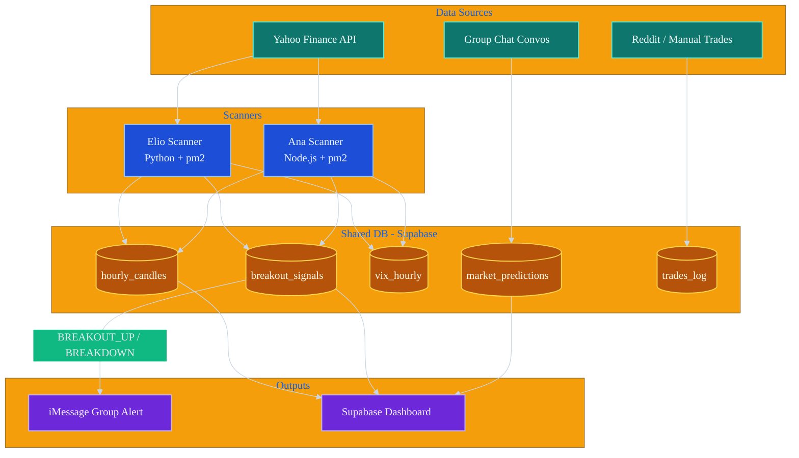
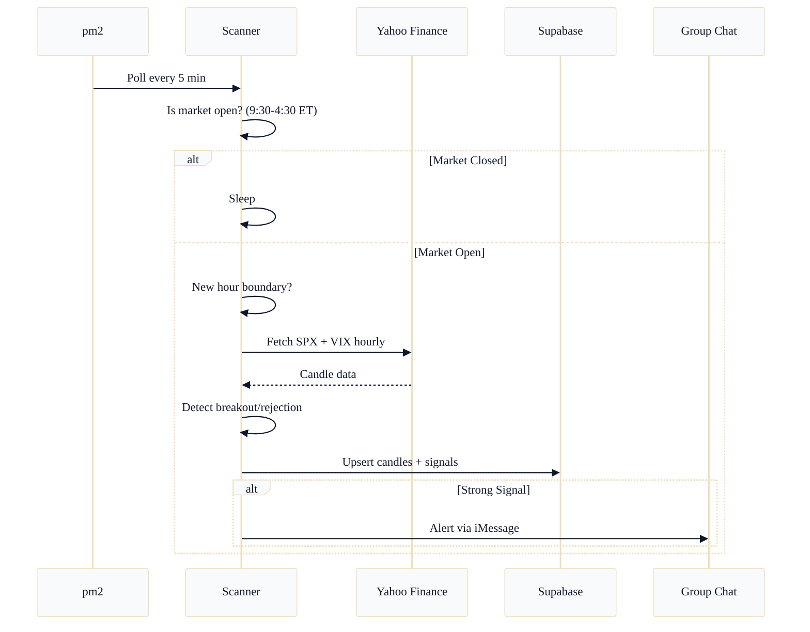
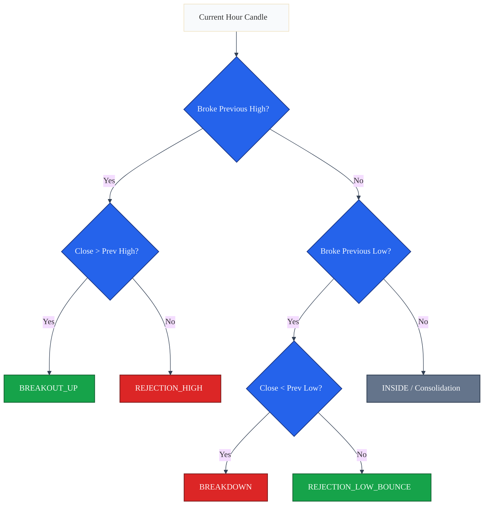
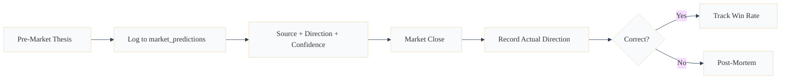

# Trading Bot Architecture

## System Overview

## Data Flow (Hourly Cycle)

## Breakout Detection Logic

## Prediction Tracking

## Infrastructure

| Component | Host | Tech | Manager |
|-----------|------|------|---------|
| Elio Scanner | Dan's Mac Mini | Python + yfinance + psycopg2 | pm2 |
| Ana Scanner | Khanh's MacBook | Node.js + pg + https | pm2 |
| Shared DB | Supabase (us-west-2) | PostgreSQL | Supabase |
| Alerts | iMessage Group Chat #6 | imsg CLI / BlueBubbles | OpenClaw |
